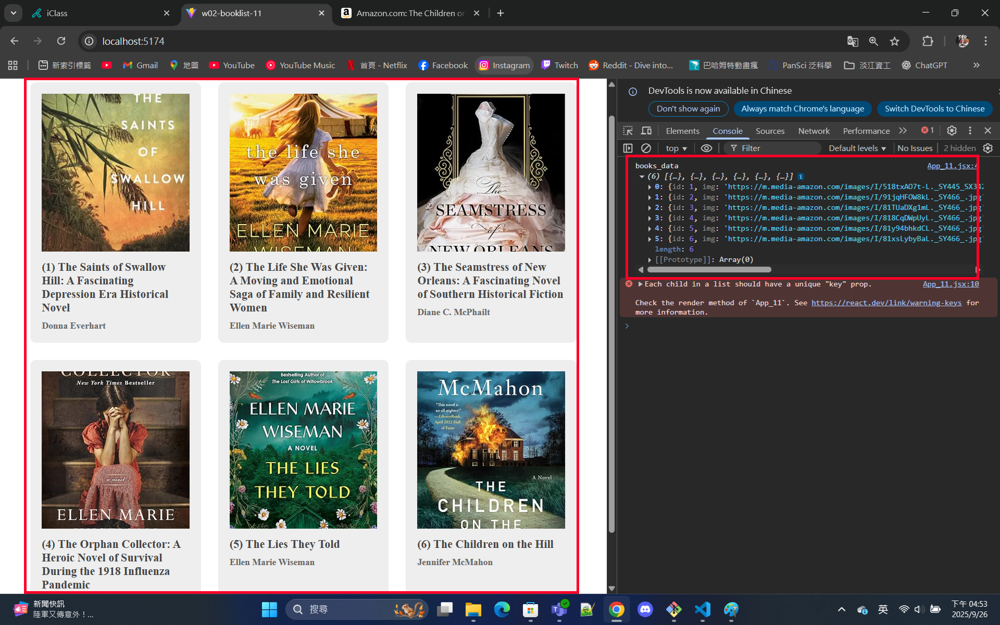
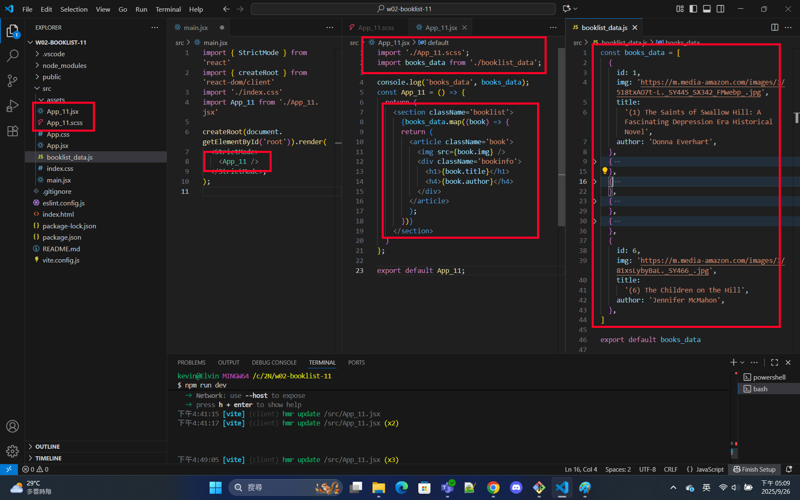
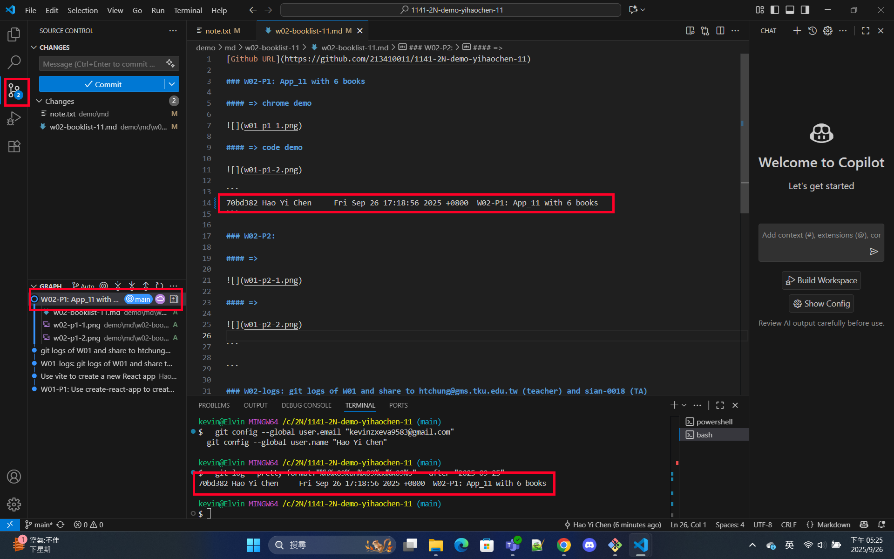
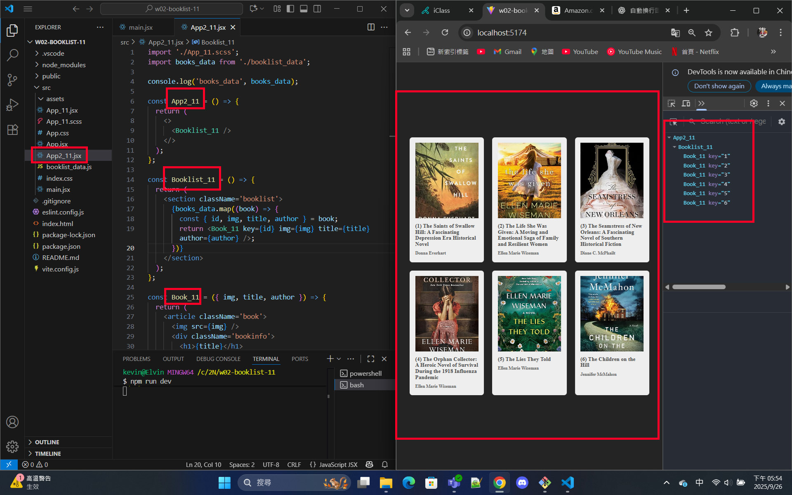

[Github URL](https://github.com/213410011/1141-2N-demo-yihaochen-11)

### W02-P1: App_11 with 6 books

#### => chrome demo



#### => code demo





```
70bd382 Hao Yi Chen     Fri Sep 26 17:18:56 2025 +0800  W02-P1: App_11 with 6 books
```

### W02-P2: refine code in w01-p1

#### => chrome demo use React DevTools



```
25764ba Hao Yi Chen     Fri Sep 26 18:03:46 2025 +0800  W02-P2: refine code in w01-p1
```

### W02-logs: git logs of W01 and share to htchung@gms.tku.edu.tw (teacher) and sian-0018 (TA)


