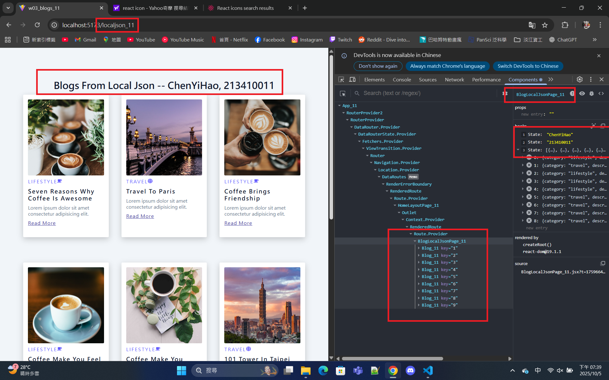
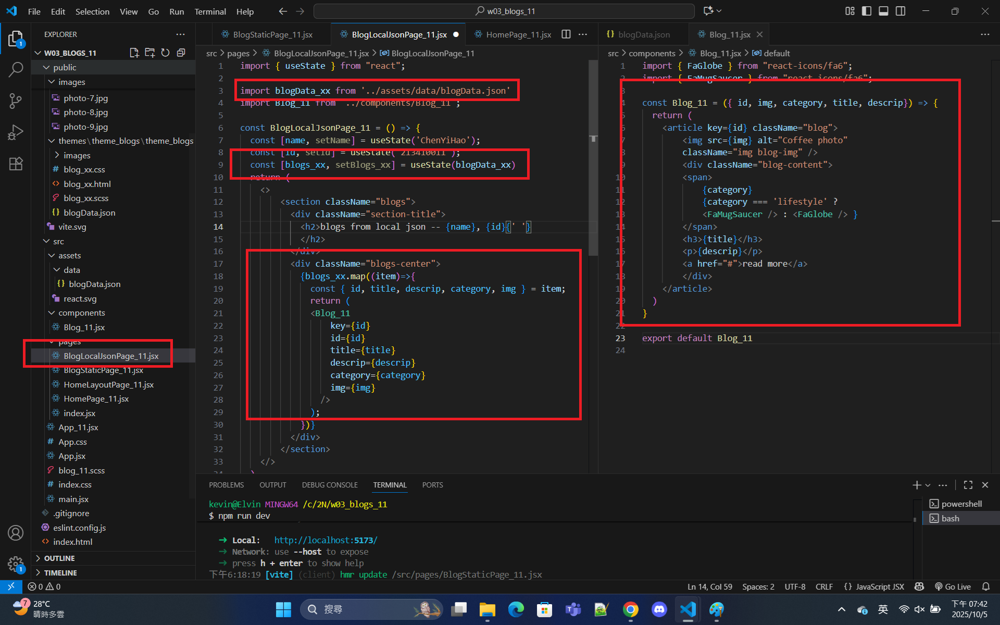

[Github URL](https://github.com/213410011/1141-2N-demo-yihaochen-11)

### W03-P1: Create router in App_11.jsx

#### => route / for HomePage_11


#### => route / static_11 for BlogStaticPage_11


```
e669a38 Hao Yi Chen     Wed Oct 1 20:14:21 2025 +0800   W03-P1: Create router in App_11.jsx
```

### W03-P2: Implement route /static_11 for BlogStaticPage_11


```
d77bdd5 Hao Yi Chen     Sun Oct 5 18:40:10 2025 +0800   W03-P2: Implement route /static_11 for BlogStaticPage_11
```

### W03-P3: Implement route /localjson_xx by showing blogs from local json
 
#### => Chrome demo using React DevTools
 

 
#### => code for BlogLocalJson_xx
 

 
```
d70d656 Hao Yi Chen     Sun Oct 5 19:46:22 2025 +0800   Implement route /localjson_xx by showing blogs from local json
```

### W03-logs: git logs of W01 and share to htchung@gms.tku.edu.tw (teacher) and sian-0018 (TA)


