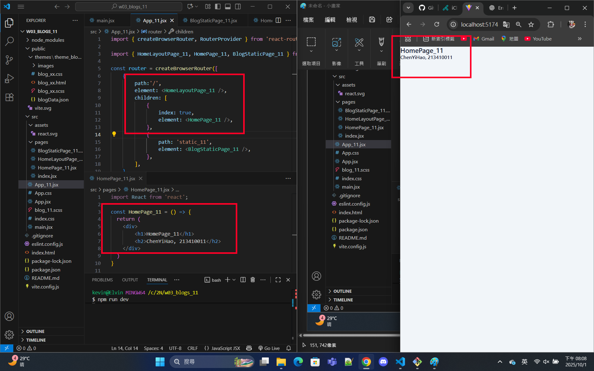
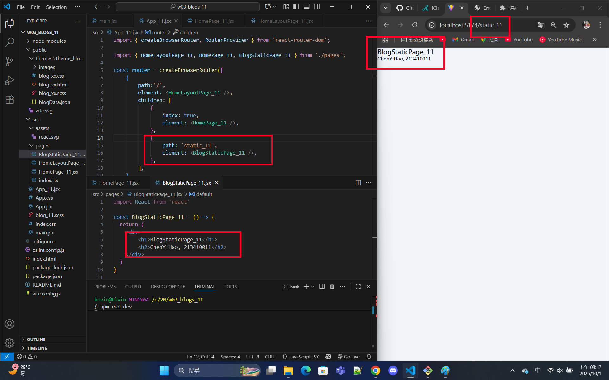
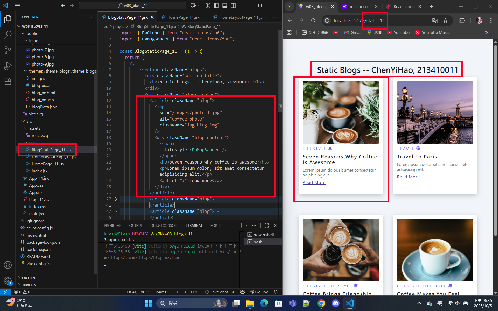

[Github URL](https://github.com/213410011/1141-2N-demo-yihaochen-11)

### W03-P1: Create router in App_11.jsx

#### => route / for HomePage_11



#### => route / static_11 for BlogStaticPage_11



```
e669a38 Hao Yi Chen     Wed Oct 1 20:14:21 2025 +0800   W03-P1: Create router in App_11.jsx
```

### W03-P2: refine code in w01-p1

#### => chrome demo use React DevTools



```
25764ba Hao Yi Chen     Fri Sep 26 18:03:46 2025 +0800  W02-P2: refine code in w01-p1
```

### W03-logs: git logs of W01 and share to htchung@gms.tku.edu.tw (teacher) and sian-0018 (TA)


