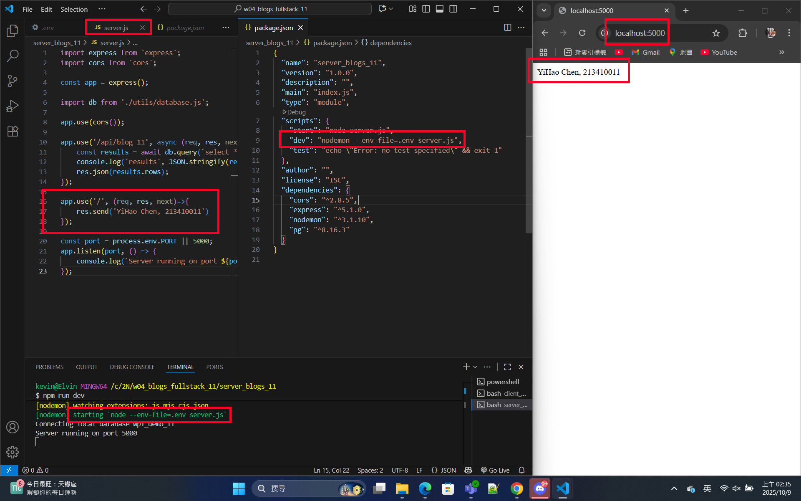

[Github URL](https://github.com/213410011/1141-2N-demo-yihaochen-11)

### W04-P1: Create a express Web server to show your info
 

 
```
aabebf6 Hao Yi Chen     Wed Oct 8 19:55:20 2025 +0800   W04-P1: Create a express Web server to show your info
```

### W04-P2: Create blog_xx table with 3 data, implement route /api/blog_xx to return a json array with 3 data
 
#### => SQL to create blog_xx table and 3 data
 

 
#### => show 3 data
 

 
#### => implement route /api/blog_xx
 

 
```
84b380b Hao Yi Chen     Thu Oct 9 01:09:58 2025 +0800   W04-P2: Create blog_xx table with 3 data, implement route /api/blog_xx to return a json array with 3 data
```

### W04-P3: from client side to get json data from Node
 
#### => modified client and server code
 

 
#### => Chrome, show 3 blogs
 

 
```
251c0c0 Hao Yi Chen     Thu Oct 9 02:30:31 2025 +0800   W04-P3: from client side to get json data from Node
```

### w04-logs: git logs of W01 and share to htchung@gms.tku.edu.tw (teacher) and sian-0018 (TA)


