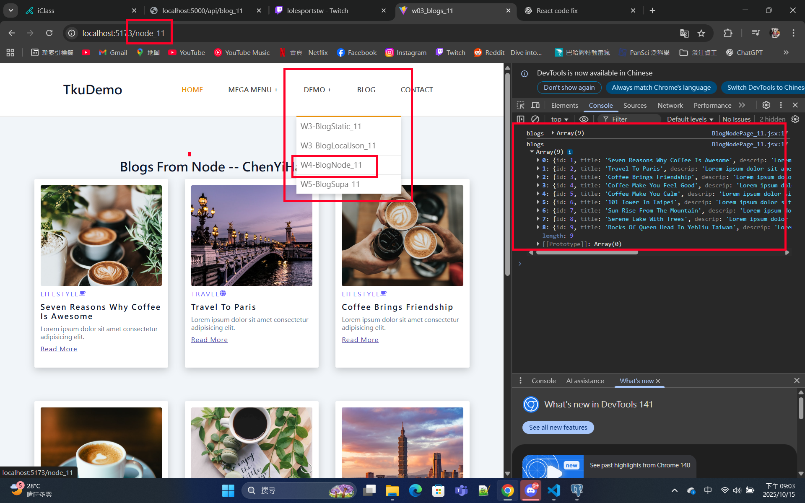
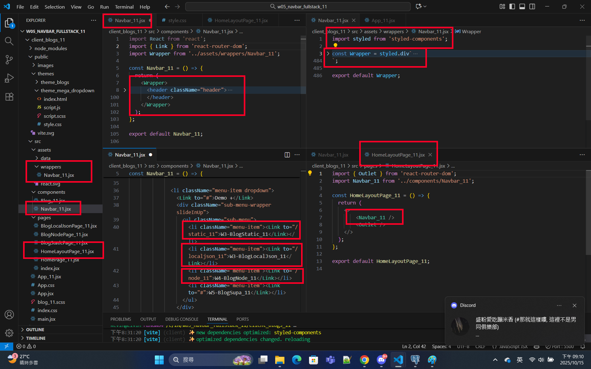

[Github URL](https://github.com/213410011/1141-2N-demo-yihaochen-11)

### W05-P1: Create Navbar_xx using styled components, and show BlogNodePage_11
 
##### => Chrome
 

 
##### => relevant code
 

 
```
44a1590 Hao Yi Chen     Wed Oct 15 21:15:03 2025 +0800         Create Navbar_xx using styled components, and show BlogNodePage_11
```

### W05-P2: Deploy the code to Vercel
 
#### => Show BlogLocalJson in Vercel
 

 
#### => Github repo with Vercel link
 

 
#### => Github demo_vecel repo and Vercel URL
 
[Github URL for Vercel](https://github.com/213410011/1141_2N_demo_vercel_ChenYiHao_11)
[Vercel URL](https://1141-2-n-demo-vercel-chenyihao-11.vercel.app/)
 
```
8338e96 Hao Yi Chen     Sun Oct 19 16:29:49 2025 +0800  W05-P2: Deploy the code to Vercel
```

### W05-P3: Use tailwind css to show HomePage_xx in Vercel
 

 
```
c0b94d6 Hao Yi Chen     Sun Oct 19 17:00:58 2025 +0800  W05-P3: Use tailwind css to show HomePage_xx in Vercel
```

### W05-P4: Show BookListPage_xx using styled components
 

 
```

```