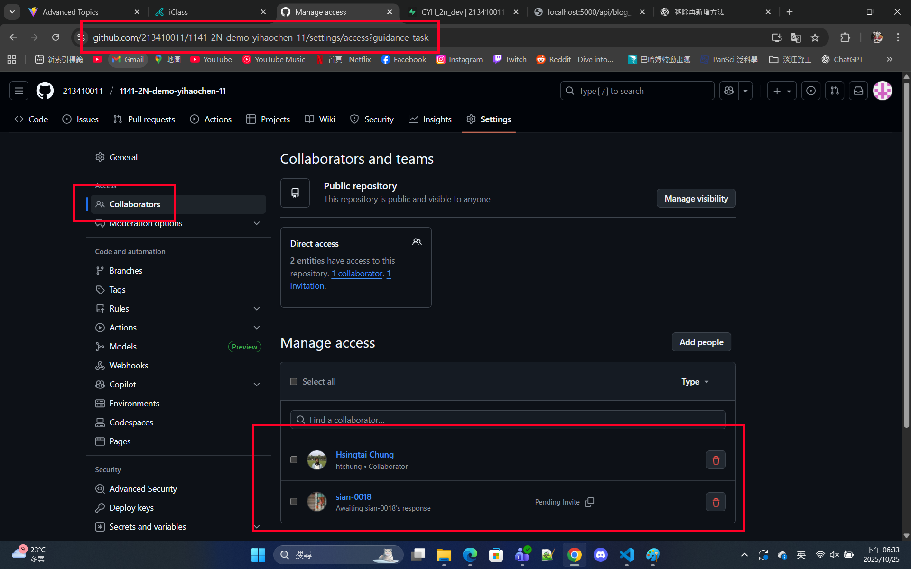
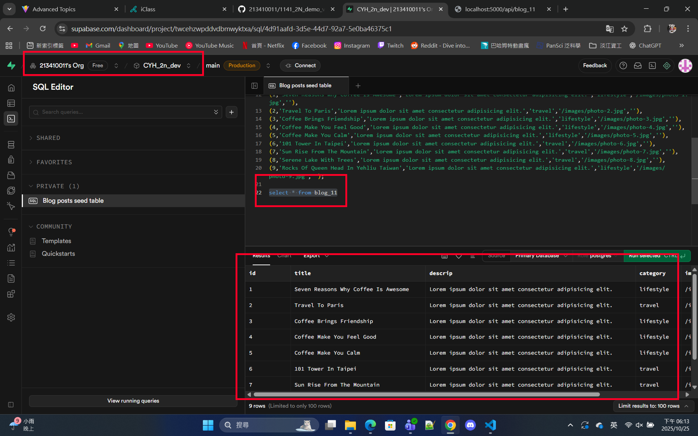
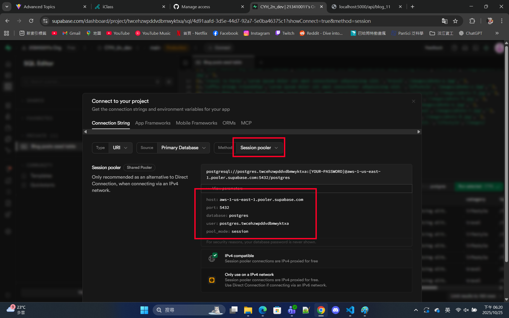
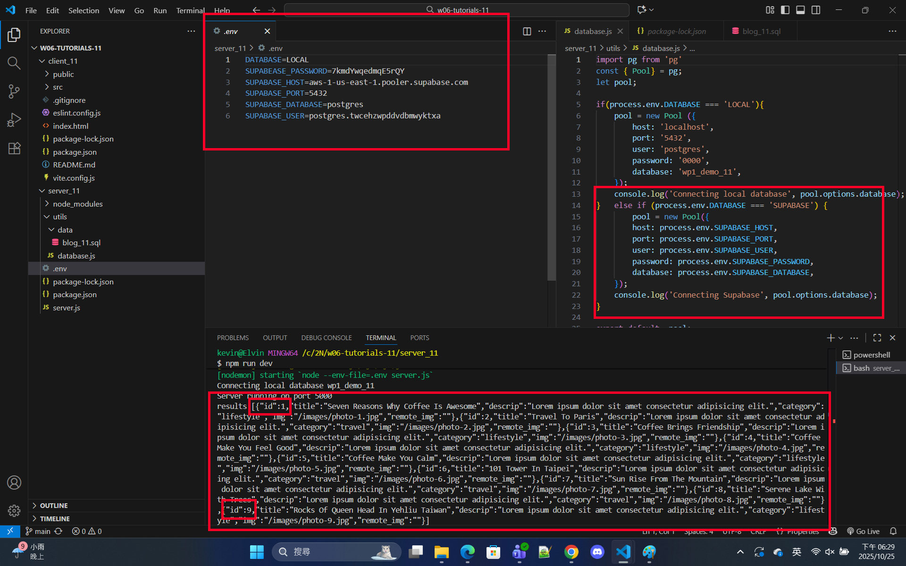

[Github URL](https://github.com/213410011/1141-2N-demo-yihaochen-11)
[Github URL for Vercel](https://github.com/213410011/1141_2N_demo_vercel_ChenYiHao_11)
[Vercel URL](https://1141-2-n-demo-vercel-chenyihao-11.vercel.app/)

### W06-P1: share URL of Github demo Vercel
 

 
```

```

### W06-P2: Supabase settings in Node.js, can connect to Supabase to get 9 blogs data
 
#### => able to get 9 blogs data in Supabase
 

 
#### => connect parameters in Supabase
 

 
#### => server code in Supabase setting
 

 
```

```