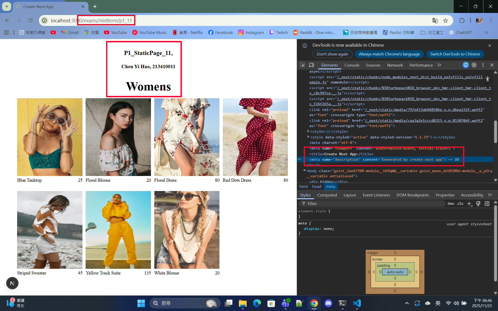
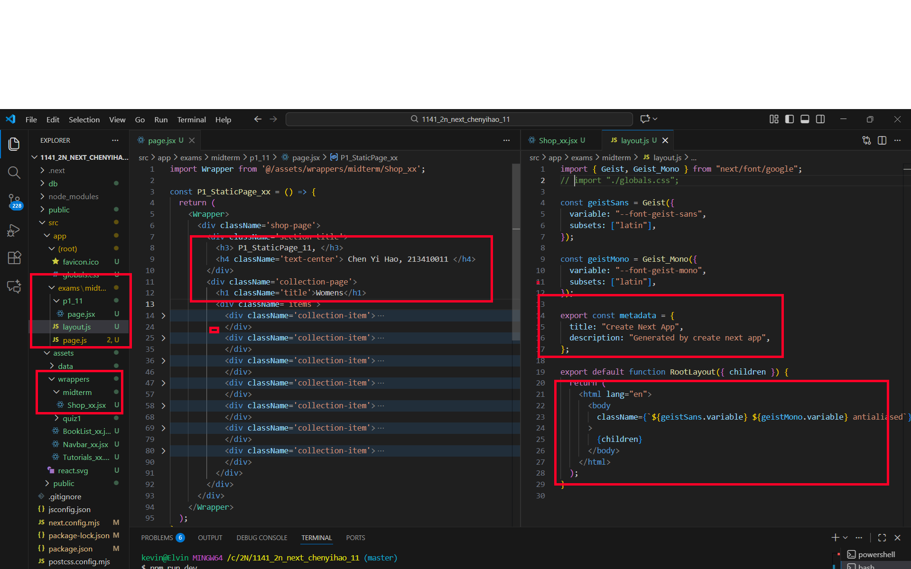
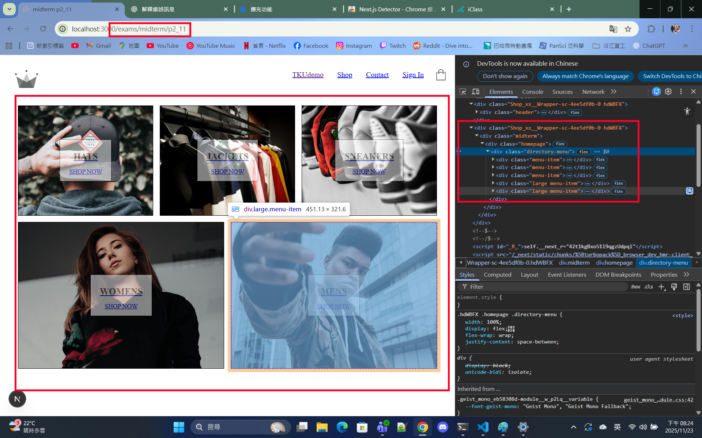
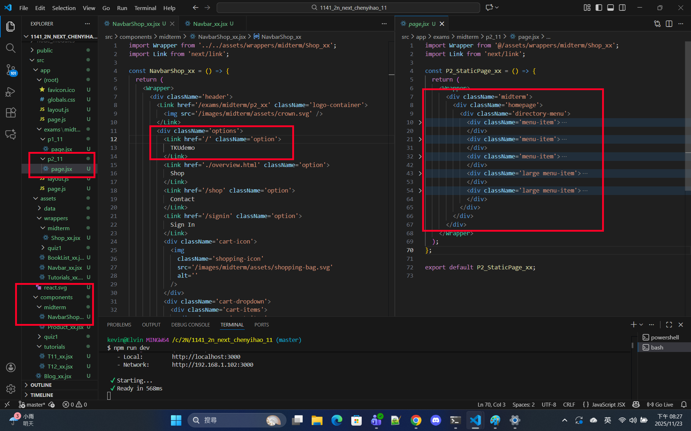
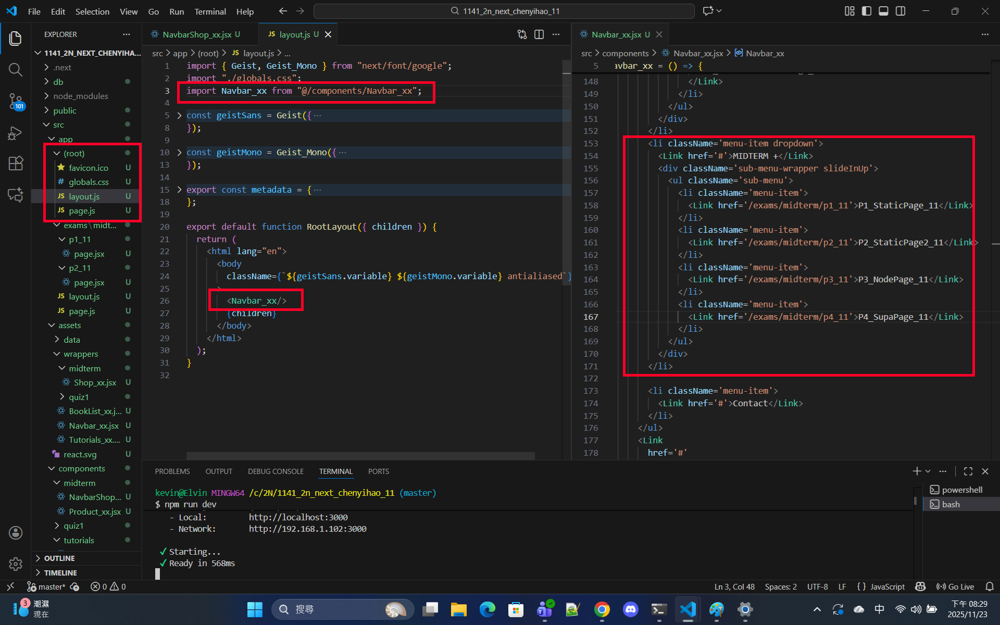

[Github URL](https://github.com/213410011/1141-2N-demo-yihaochen-11)
[Github URL for Vercel](https://github.com/213410011/1141_2N_demo_vercel_ChenYiHao_11)
[Vercel URL](https://1141-2-n-demo-vercel-chenyihao-11.vercel.app/)

### W10-P1: implement /exams/midterm/p1_xx for P1 in mid-1
 
##### => Chrome, show P1 page with meta data
 

 
##### => show the relevant code
 

 
```
ee4fdb6 Hao Yi Chen     Sun Nov 23 18:53:16 2025 +0800  W10-P1: implement /exams/midterm/p1_xx for P1 in mid-1
```

### W10-P2: Implement /exams/miderm/p2_xx for P2 in mid-1
 
#### => shown in Chrome
 

 
#### => the relevant code for P2
 

 
#### => Navbar_xx for root layout
 

 
```
ab03b01 Hao Yi Chen     Sun Nov 23 20:31:42 2025 +0800  W10-P2: Implement /exams/miderm/p2_xx for P2 in mid-1
```