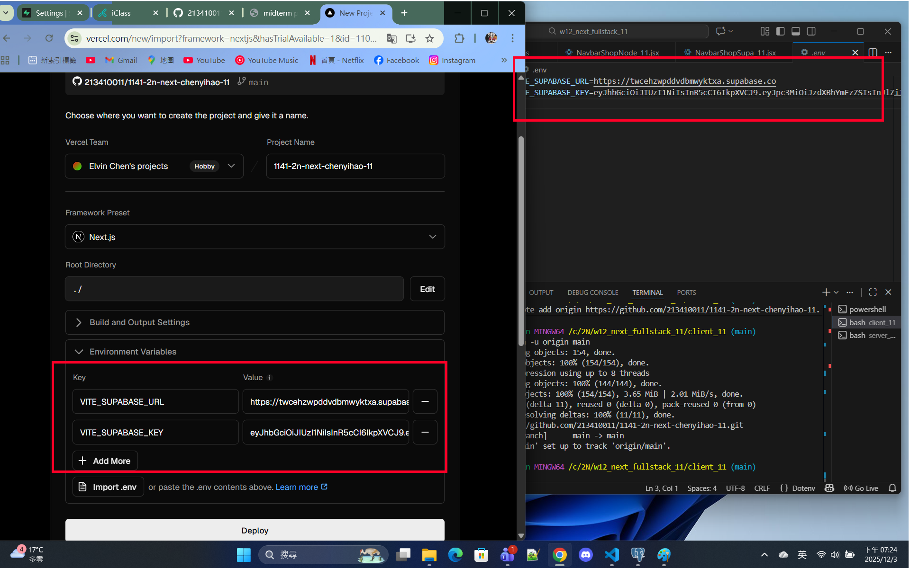
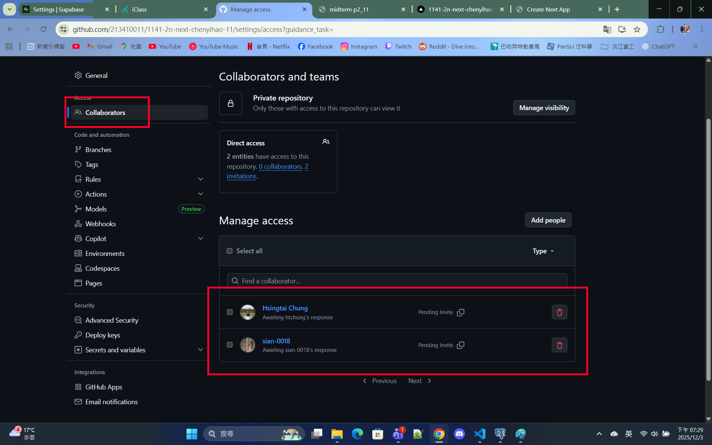

[Github URL](https://github.com/213410011/1141-2N-demo-yihaochen-11)
[Github URL for Vercel](https://github.com/213410011/1141_2N_demo_vercel_ChenYiHao_11)
[Vercel URL](https://1141-2-n-demo-vercel-chenyihao-11.vercel.app/)

### W12-P1: Refine code of /demo/shop_xx/node
 
##### =>
 

 
```
0d9de76 Hao Yi Chen     Wed Dec 3 20:44:28 2025 +0800   W12-P1: Refine code of /demo/shop_xx/node
```
 
### W12-P2: Deploy code to Vercel
 
#### => npm run build
 

 
#### => npm start
 

 
#### => Vercel, add environment variables
 

 
#### => Vercel homepage success
 

 
#### => Github repo and Vercel URL
 
[Gitbub Next URL](https://github.com/213410011/1141-2n-next-chenyihao-11)
[Vercel Next URL](https://1141-2n-next-chenyihao-11.vercel.app/)
 

 
#### => Share to teacher and TA
 
htchung@gms.tku.edu.tw
sian-0018
 

 
```
abc1a5f htchung Wed Dec 3 19:35:31 2025 +0800   W12-P2: Deploy code to Vercel
```