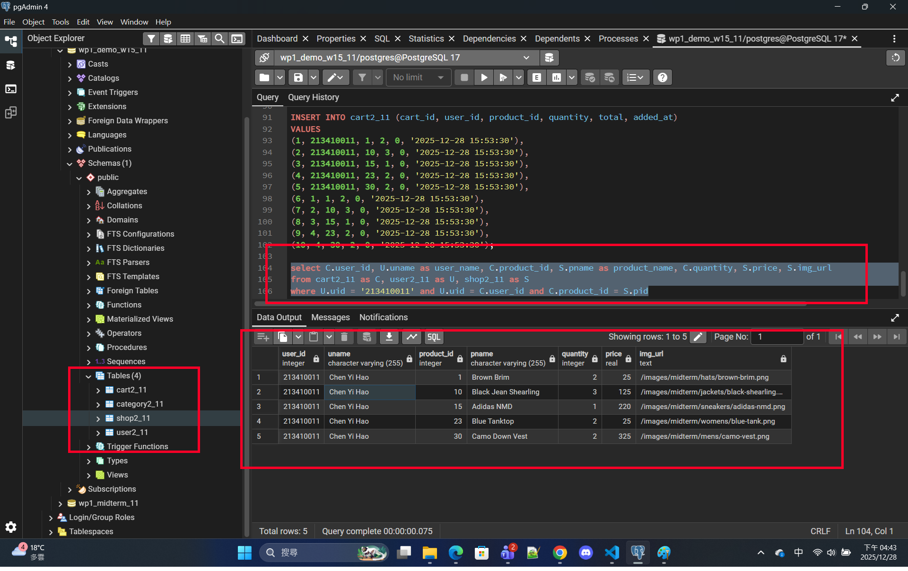
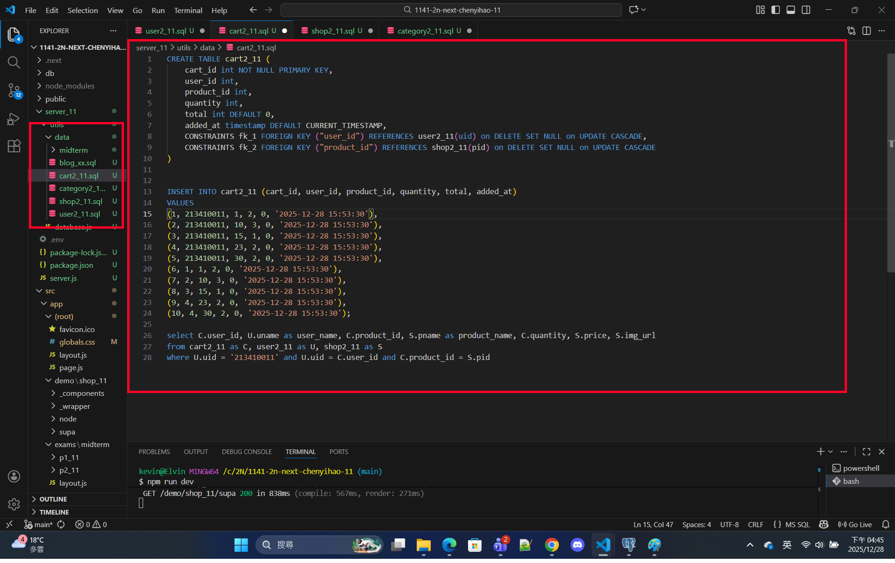
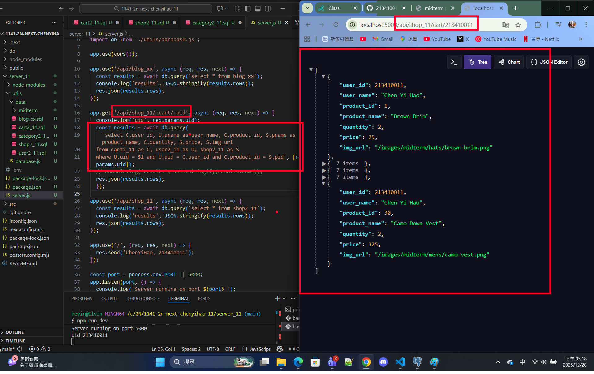
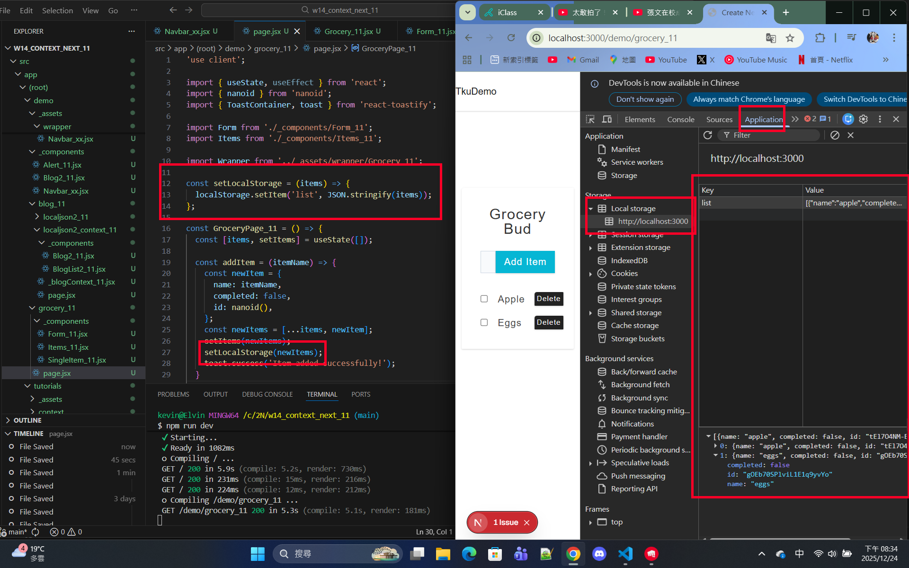

[Github URL](https://github.com/213410011/1141-2N-demo-yihaochen-11)
[Github URL for Vercel](https://github.com/213410011/1141_2N_demo_vercel_ChenYiHao_11)
[Vercel URL](https://1141-2-n-demo-vercel-chenyihao-11.vercel.app/)

### W15-P1: Create tables category2_xx, shop2_xx, user2_xx, cart2_xx, and put 5 products into a cart for the user of your id
 
#### => pgAdmin4, show SQL command to get the needed info
 

 
#### => sql code
 

 
```
d6f6e52 Hao Yi Chen     Sun Dec 28 16:47:51 2025 +0800  W15-P1: Create tables category2_xx, shop2_xx, user2_xx, cart2_xx, and put 5 products into a cart for the user of your id
```

### W15-P2: Implement route /api/shop_xx/cart/:uid to get the info as the SQL in W15-P1
 

 
```
4af258c Hao Yi Chen     Sun Dec 28 17:21:07 2025 +0800  W15-P2: Implement route /api/shop_xx/cart/:uid to get the info as the SQL in W15-P1
```

### W15-P3: Use localStorage
 
#### => Implement setLocalStorage
 

 
#### => Implement getLocalStorage
 

 
```

```